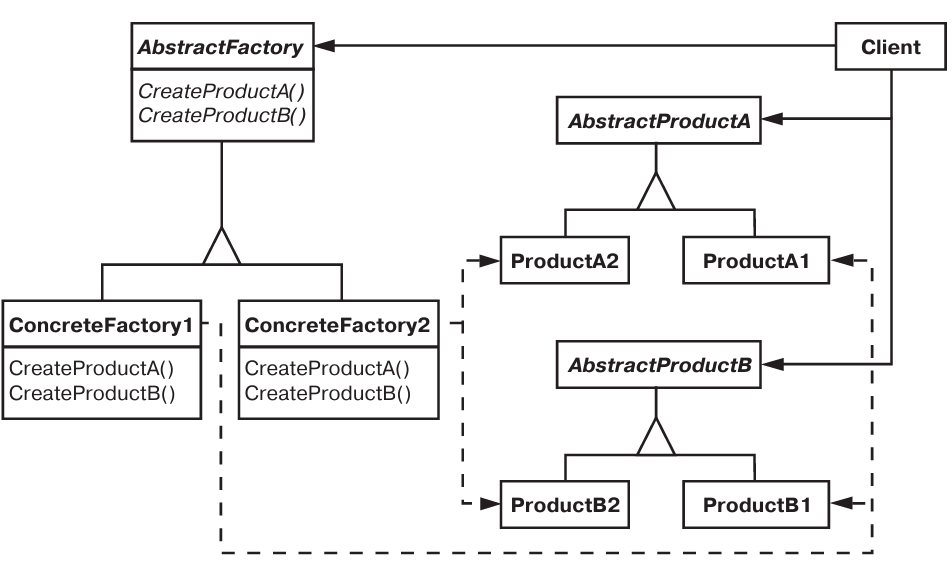

# Паттерн Abstract Factory

Абстрактная фабрика (инструментарий (kt)) - порождающий паттерн, уровня объекта.

## Назначение

Предоставляет интерфейс для создания семейств взаимосвязанных или взаи  мозависимых объектов, не специфицируя их конкретных классов.

## Мотивация

* Нужно отказаться от жестко закодированного семейства объектов.

## Применимость

* Система не должна сависить от реализации входящих в нее объектов.
* Входящии в семейство взаимосвязанные объекты должны использоваться вместе.
* Система должна конфигурироваться с одним из семейств.
* Необходимость сокрыть реализацию объектов, расрыть только интерфейсы.

## Описание устройства

Типичная структура паттерна:

## Участники

* *AbstractFactory* - объявляет интерфейс для операций создания обстрактных объектов-продуктов.
* ConcreteFactory - реализует операций для создания конкретных объектов-продуктов.
* AbstractProduct - объявляет интерфейс для типа объекта-продукта.
* *ConcreteProduct* - определяет объект-продукт, создаваемый ContreteFactory.
* *Client* - пользуется лишь интерфейсом AbstractFactory и AbstractProduct.

## Отношения

* ConcreteFactory создает объекты ConretePoduct.
* AbstractFactory передоверяет создание объектов ConcreteFactory.

## Результаты

* Изоляция конкретных классов.
* Упрощение замены семейств продуктов.
* Появляется гарантия сочетаемости продуктов.
* Минус: трудности с поддержкой новых видов продуктов.

## Реализация

* *Один экземпляр фабрики* - паттерн одиночка.
* *Создание продуктов* - для реалзиции ConcreteFactory можно использовать *фабричный метод* или *прототип*.
* *Определение расширяемых фабрик* - можно объявить один создающий метод в AbstractFactory, параметризованный неким аргументом, по которому можно получить тип создаваемого объекта.
