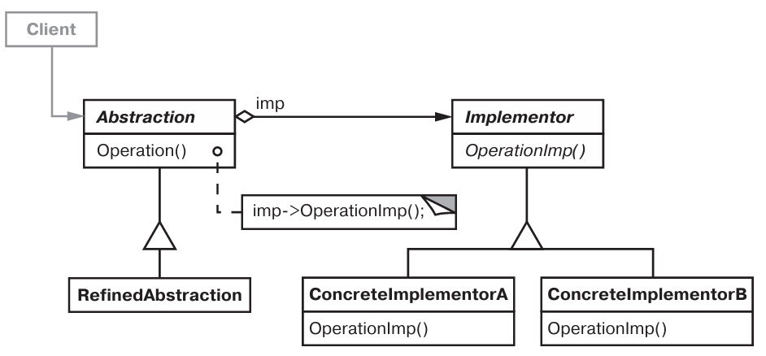

# Паттерн Bridge

Мост - структрурный паттерн уровня объекта.

## Назначение

Отделить абстракцию от ее реализации так, чтобы то и другое можно было  изменять независимо.

## Мотивация

Необходим более гибкий способ создания нескольких реализаций абстракции, чем наследование.

## Применимость

* Необходимо избежать постоянной привязки абстракции к реализации. Например, нужно выбирать реализацию во время выполнения.
* Нужно расширять абстракции и реализации новыми подклассами.
* Нужно уйти от перекомпиляции клиентского кода.
* (С++) Нужно скрыть реализацию абстракции для клиентов.
* Необходимо уйти от большого числа классов.
* Необходимо разделить реализацию между несколькими объектами, и этот факт нужно скрыть от клиента.

## Описание устройства

Типичная структура паттерна:

## Участники

* *Abstraction* - определяет интерфейс абстракции, хранит ссылку на Implementor.
* *RefinedAbstraction* - расширяет интерфейс Abstraction.
* *Implementor* - объявляет интерфейс реализации, может иметь иной интерфейс чем Abstraction.
* *ConcreteImplementor* - реализация интерфейса Implementor.

## Отношения

Объект Abstraction перенаправляет своему объекту Implementor запросы клиента.

## Результаты

* Отделение реализации от интерфейса.
* Повышение степени расширямости.
* Сокрытие деталий реализации от клиентов.

## Реализация

* *Только один класс Implementor* - если пока есть только одна реализация.
* *Создание правильного Implementor* - в конструкторе Abstraction; зареннее выбран, а потом может быть изменен в зависимости от обстоятельств; делегировать другому объекту решение (абстрактная фабрика).
