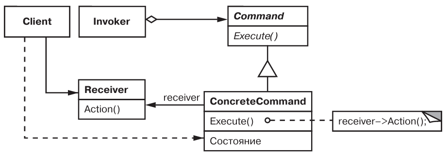
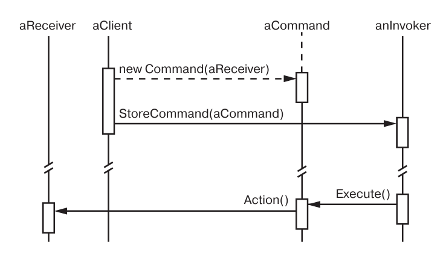

# Паттерн Command

Командв - поведенческий паттерн уровня объекта.

## Назначение

Инкапсулирует запрос как объект, позволяя тем самым задавать параметры  клиентов для обработки соответствующих запросов, ставить запросы в очередь или протоколировать их, а также поддерживать отмену операций.

## Мотивация

Необходимо посылать запросы объектам, ничего не зная о конкретной запрошенной операции.

## Применимость

* Нужно параметризовать объекты выполнения действем.
* Нужна очередь запросов.
* Нужна поддержка отмены операций.
* Нужна поддержка протоколирования изменений.
* Нужно структурировать систему на основе высокоуровневых операций, построенных из примитивных.

## Описание устройства

Типичная структура паттерна:

Диаграмма последовательности работы паттерна:

## Участники

* *Command* - объявляет интерфейс для выполнения операций.
* *ConcreteCommand* - определяет связь Receiver-действие, определяет Execute() путем вызова операций Receiver.
* *Client* - создает объект ConcreteCommand и устанавливает его получателя.
* *Invoker* - обращается к команде для выполения запроса.
* *Receiver* - распологает информацией о способах выполения операций, необходимых для удовлетворения запроса.

## Отношения

* Client создает объект ConcreteCommand и устанавливает для него Receiver.
* Invoker сохраняет объект ConcreteCommand.
* Ivoker вызывает Execute() или Unexecute() ConcreteCommand.
* ConcreteCommand вызывает нужные для выполения запроса методы Receiver.

## Результаты

* Разделение объектов на инициализирующих операцию и выполняюищих ее.
* Команды - это объекты.
* Легкое добавление новых команд.

## Реализация

* *Нужно учитывать насколько "умной" должна быть команда*.
* *Поддержка отмены и повтора операций* - в ConcreteCommand можно сохранять необходимую для этого информацию.
* *Как избежать накопление ошибок при отмене* - можно использовать Хранитель.
* *(C++) можно использовать шаблоны* - для создания подклассов Command, если команда не принимает аргументы и не имеет операцию отмены.
