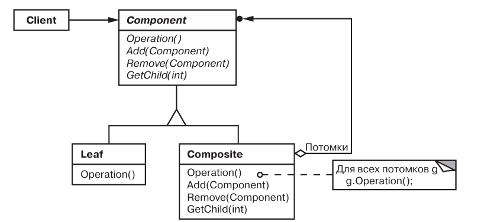
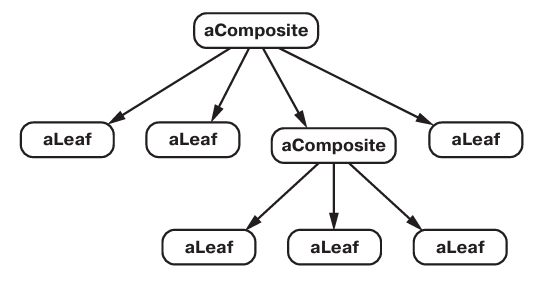

# Паттерн Composite

Компоновщик - структрурный паттерн уровня объекта.

## Назначение

Компонует объекты в древовидные структуры для представления иерархий часть-целое. Позволяет клиентам единообразно трактовать индивидуальные и составные объекты.

## Мотивация

В программе одни объекты должны состоять из более мелких. Объект контейнер в свою очередь может быть частью более крупного.

## Применимость

* нужно составить иерархию объектов вида часть-целое.
* нужно, чтобы клиенты единообразно трактовали составные и индивидуальные объекты.

## Описание устройства

Основной элемент этого паттерна - абстрактный класс, ялвяющийся одноврыменно контейером и примитивом. Объекты, созданные из объектов наследников этого абстрактного объекта, называются *составными*.

Типичная структура составного объекта:

## Участники

* *Component* - объявляет интерфейс для компонуемых объектов.
* *Leaf* - определяет листовые узлы, не имееющие потомков.
* *Composite* - определяет поведение компонентов, имеющих потомков.
* *Client* - клиент, манипулирующий с объектыми композиции через интерфейс Component.

## Отношения

Клиент использует интерфейс Component для работы с объектами в составной структуре. Если получатель запроса - Composite, то запрос перенаправляется дальше по иерархии потомкам. Если получатуль Leaf - то он обрабатывает запрос.

## Результаты

* Определяет иерархии классов, состоящии из примитивов и составных объектов.
* Упрощает архитектуру клиента.
* Облегчает добавление новых видов компонентов.
* Способствует созданию общего дизайна.

## Реализация

* *Явные ссылки на родителей* - компонент может иметь ссылку на родителя.
* *Разделение компонентов* - можно разделять компоненты, для уменьшения расхода памяти.
* *Максимизация интерфейса Component* - Component предоставляет реализации по умолчанию, а Leaf и Composite должны переопределить реализации.
* *Объявление операций для управления потомками* - можно объявить операции в Component или только в Composite -> выбор между безопасностью и прозрачностью.
* *Должен ли Component  реализовывать список компонентов* - зависит от требований к производительности и количеста потомков.
* *Кэширование* - Если приходится часто обходить композицию или производить в ней поиск, то класс Composite может кэшировать информацию об обходе и поиске.
* *Кто должен удалять компоненты* - Composite.
* *Какая структура лучше всего подходит для хранения компонентов* - зависит от требований.
