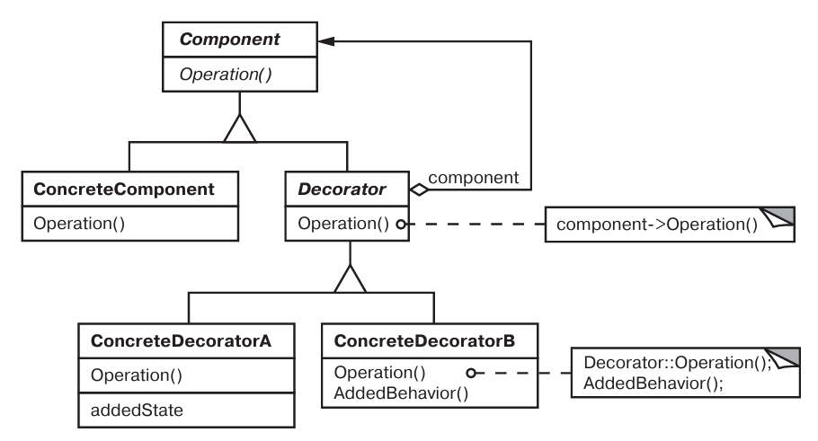
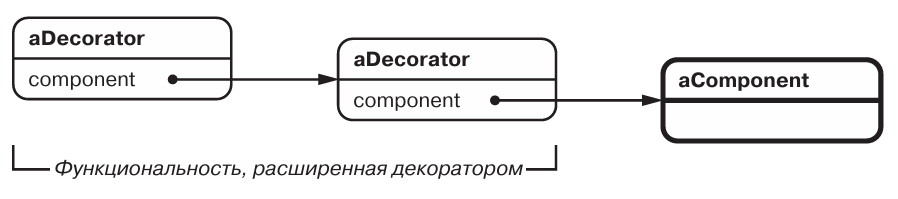

# Паттерн Decorator

Декоратор (или Обертка (Wrapper)) - структурный паттерн уровня объекта.

## Назначение

Динамически добавляет объекту новые обязанности. Является гибкой альтер  нативой порождению подклассов с целью расширения функциональности.

## Мотивация

* Нужно возложить доп. обязанности на объект, но не на весь класс этого объекта.

## Применимость

* Динамическое добавление обязанностей объектам.
* Реализация отсутсвующих в объекте обязанностей.
* Для расширение путем композиции, при отсутсвии возможности наследовать.

## Описание устройства

Типичная структура паттерна:

Последовательность декораторов, замыкаемые компонентом:

## Участники

* *Component* - определяет интерфейс для объекто, на к-ые могут быть динамически возложены дополнительные обязанности.
* *ConcreteComponent* - обределяет объект, на который возлогаются доп. обязаности.
* *Decorator* - хранит ссылку на объект Component, определяет интерфейс соот. интер. Component.
* *ConcreteDecorator* - возлагает дополнительные обязанности на Component.

## Отношения

* Decorator переадресует запросы объекту Component.

## Результаты

* БОльшая гибкость, по сравнению с наследованием.
* Нет перегруженных функциями классов на верхних уровнях иерархии наследования.
* Минус: декоратор и его компонент не идентичны.
* Минус: множество мелких объектов.

## Реализация

* *Соответствие интерфейсов* - интерфейс декоратор должен соответствовать интерфейсу декорируемого объекта.
* *Отсутствие абстрактного класса Decorator* - если планируется только одна обязонность - то можно сделать Decorator конкретным.
* *Облегченные классы Component* - Component должен быть легким: не содержать данных и содержать как можно меньше функций.
* *Изменение облика, а не внутреннего устройства* - у объекта должна появляется новая оболочка.
