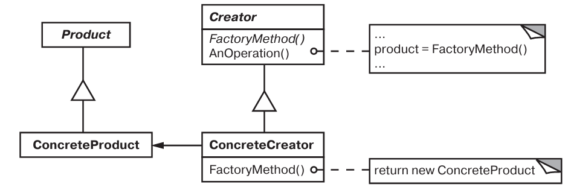
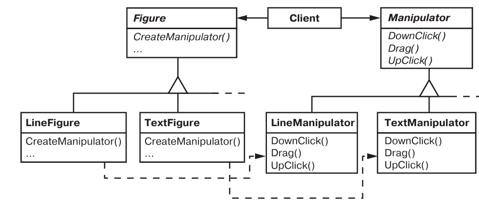

# Паттерн Factory Method

Фабричный метод  (Виртуальный конструктор (Virtual constructor)) - порождающий паттерн, уровня класса.

## Назначение

Определяет интерфейс для создания объекта, но оставляет подклассам реше  ние о том, какой класс инстанцировать. Фабричный метод позволяет классу де  легировать инстанцирование подклассам.

## Мотивация

* Нужно инкапсулировать информацию о том, какой экземпляр конкретного подкласса абстрактного класса создать.

## Применимость

* Классу заранее неизвестно, объекты каких классов ему нужно создавать.
* Класс спроектирован так, чтобы объекты, которые он создает, специфици  ровались подклассами.
* Класс делегирует свои обязанности одному из нескольких вспомогательных  подклассов, и вы планируете локализовать знание о том, какой класс при  нимает эти обязанности на себя.

## Описание устройства

Типичная структура паттерна:

## Участники

* *Product* - определяет интерфейс объектов, создаваемых фабричным методом.
* *ConcreteProduct* - реализует интерфейс Product.
* *Creator* - объявляет фабричный метод, возвращающий объекто типа Product.
* *ConcreteCreator* - замещает фабричный метод, возвращает ConcreteProduct.

## Отношения

* *Creator* полагается на свои подклассы в определении фабричного метода, который будет возвращать ConcreteProduct.

## Результаты

* Избавляет от необходимости встраивать в код зависящие от приложение классы, можно взаимодейстовать только с интерфейсом Product.
* Минус: возможно придется создавать конкретный подкласс Creator только лишь для создания одного объекта.
* Предоставяет подклассам операции (hooks) - можно определить реализацию по умолчянию.
* Соединяет параллельные иерархии:

## Реализация

* *Две разновидности паттерна* - с наличием реализации фабричного метода в Create и без него (конкретный Crete).
* *Параметризованные фабричные методы* - позволяет создавать разные виды продуктов.
