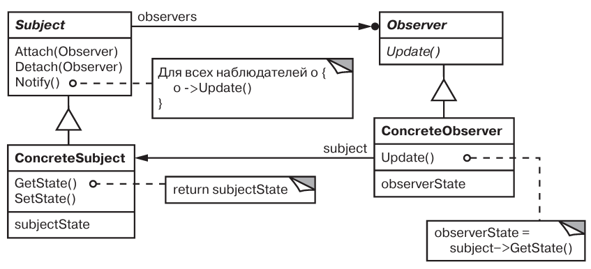
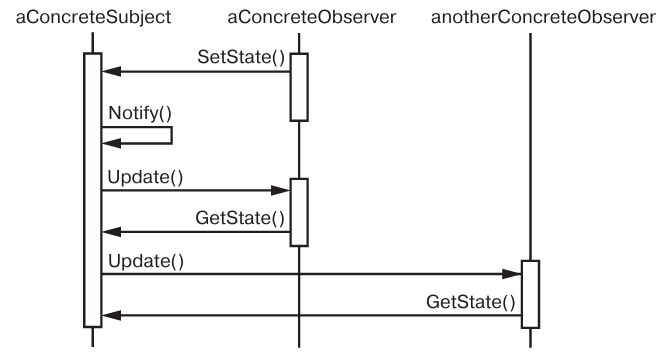
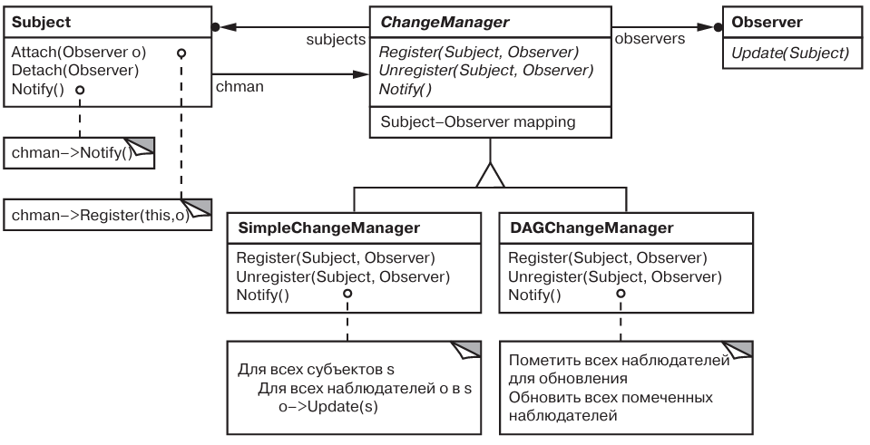

# Паттерн Observer

Наблюдатель - поведенческий паттерн, уровня объекта.

## Назначение

Определяет зависимость типа «один ко многим» между объектами таким об  разом, что при изменении состояния одного объекта все зависящие от него опове  щаются об этом и автоматически обновляются.

## Мотивация

* Нужно инкапсулировать информацию о том, какой экземпляр конкретного подкласса абстрактного класса создать.

## Применимость

* Когда у абстракции есть два аспекта, один из которых зависит от другого.  Инкапсуляции этих аспектов в разные объекты позволяют изменять и повторно использовать их независимо. Необходимость поддерживать согласованное состояние взаимосвязанных объектов. Но не хочется платить жесткими связями.
* Когда при модификации одного объекта требуется изменить другие и вы не  знаете, сколько именно объектов нужно изменить.
* Когда один объект должен оповещать других, не делая предположений об  уведомляемых объектах. Другими словами, вы не хотите, чтобы объекты  были тесно связаны между собой

## Описание устройства

Типичная структура паттерна:

Лайфлайны объектов:

*(aConcreteObserver откладывает изменение своего состояния, вызывая SetState())*

## Участники

* *Subject* - определяет интерфейс присоединения и отделения наблюдателя.
* *Observer* - определяет интерфейс обновления для объектов.
* *ConcreteSubject* - сохраняет состояние, посылает информацию своим наблюдателям.
* *ConcreteObserver* - хранит ссылку на ConcreteSubject, реализует интерфейс обновления.

## Отношения

* ConcreteSubject уведомляет своих наблюдателей.
* После получения от конкретного субъекта уведомления ConcreteObserver может запросить у субъекта дополнительную информацию.

## Результаты

* Абстрактная связанность субъекта и наблюдателя.
* Поддержка широковещательных коммуникаций.
* (Минус) Нежелательные обновления.

## Реализация

* *Наблюдение более чем за одним субъектом* - передавать в Observer::Update() this.
* *Кто инициирует обновление* - сам Subject (может вызвать нежелательные обновления) или сам Client (+ ответственность для клиента).
* *Гарантии непротиворечивости состояния субъекта* - необходимо убеждаться, что перед Notify() состояние субъекта - верно.
* *Выбор протокола обновления* - push model v.s. pull model.
* *Явное специфицирование представляющих интерес модификаций* - указание интересующего объект события при регистрации, подписка на определенное событие.
* *Инкапсуляция сложной семантики обновления* - создание класса ChangeManager.

### ChangeManager

У класса ChangeManager есть три обязанности:

* строить отображение между субъектом и его наблюдателями и предо  ставлять интерфейс для поддержания отображения в актуальном состоянии. Это освобождает субъектов от необходимости хранить ссылки на  своих наблюдателей и наоборот;
* определять конкретную стратегию обновления;
* обновлять всех зависимых наблюдателей по запросу от субъекта.

