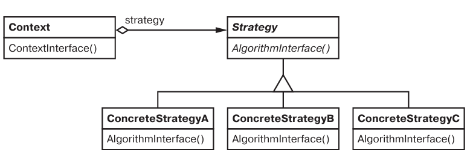

# Паттерн Strategy

Стратегия - поведенческий паттерн уровня объекта.

## Назначение

Определяет семейство алгоритмов, инкапсулирует каждый из них и делает их взаимозаменямыми. Позволяет имзенять алгоритмы независимо от клиентов, которые ими пользуются.

## Мотивация

* Нужно избавиться от кодирования алгоритмов прямо в классе, который их использует.
* Нужно иногда подменять один алгоритм, другим.
* Нужно облегчить модификацию и добавление алгоритмов.

## Применимость

* Есть много родственных классов, которые отличаются только поведением.
* Нужно иметь несколько алгоритмов.
* Нужно сокрыть данные, содержащиеся в алгоритме, от клиента.
* В классе много поведений, определенных через ветвления.

## Описание устройства

Абстрактный класс стратегии, конкретные классы стратекий (алгоритмов) и контекст.

Типичная структура паттерна:

## Участники

* *Strategy* - объявляет общий для всех алгоритмов интерфейс.
* *ConcreteStrategy* - реализует конкретный алгоритм, использует интерфейс Strategy.
* *Context* - конфигурируется классом ConcreteStrategy, хранит сслыку на объект Strategy. Может определять интерфейс доступа к данным контекста.

## Отношения

* Context передает Strategy данные для работы алгоритма, Strategy может изменять данные в Context.
* Context делегирует запросы своих клиентов классу ConcreteStrategy.
* Клиенты создают объект Context передавая ConcreteStrategy.

## Результаты

* Семейство родственных алгоритмов.
* Альтернатива пораждению подклассов Context.
* Избавление от условных операторов в классе.
* Возможность выбора реализации поведения.
* Минус: клиент должен знать и понимать различия в стратегиях.
* Минус: для простых алгоритмов, некоторые переданные данные не будут использоваться.
* Минус: увеличение числа объектов.

## Реализация

* *Определение интерфейсов классов Strategy и Context* - можно передавать в Strategy не данные из Context, а ссылку на Context, чтобы ConcreteStrategy мог сам запрашивать необходимые данные.
* *Можно передавать стратегию как параметр шаблона Context* - если Context определяется на этапе компиляции, и не нужно в рантайме менять в нем стратегию.
* *Можно определить для Context поведение по умолчанию*.
