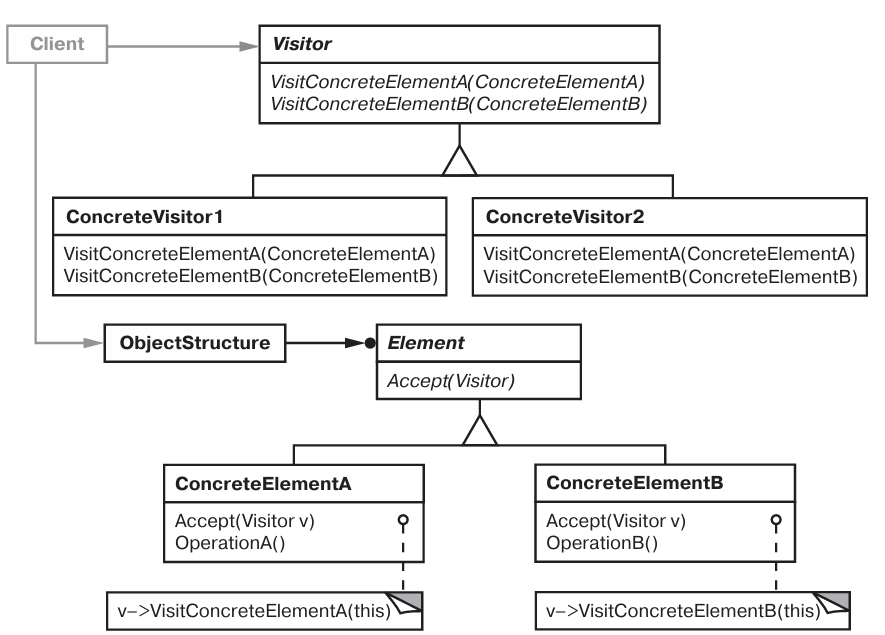
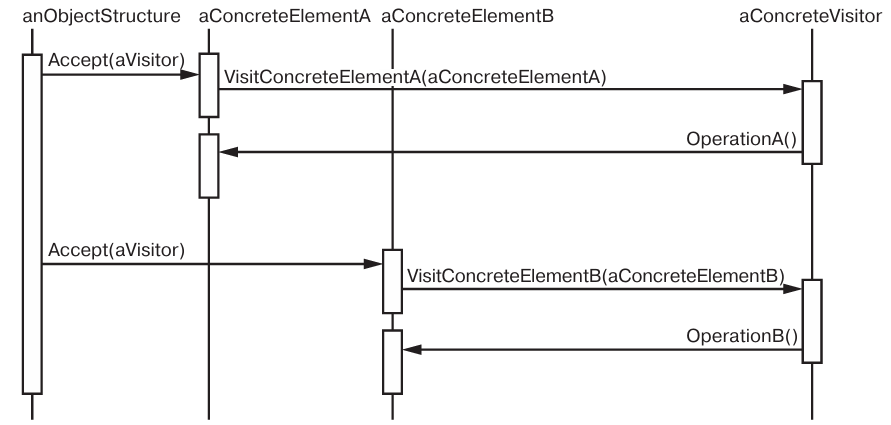

# Паттерн Visitor

Посетитель - поведенческий паттерн уровня объекта.

## Назначение

Описывает операцию, выполняемую с каждым объектом из некоторой структуры. Паттерн посетитель позволяет определить новую операцию, не изменяя классы этих объектов.

## Мотивация

Необходимо добавлять новые операции для объетков итерируемых структур и уйти от изменения этих структур и их объектов.

## Применимость

* В структуре присутствуют объекты многих классов с различными интерфейсами и вы хотите выполнять над ними операции, зависящие от конкретных  классов.
* Нужно уйти от засорения классов разнообразными операциями. Посетитель позволяет включить в приложение только нужную ему операцию.
* Состав конкретных классов струтктуры объектов меняется редко, а новые операции появляются часто.

## Описание устройства

Типичная структура паттерна:

Диаграмма последовательности работы паттерна:

## Участники

* *Visitor* - объявляет операция visit для каждого класса ConcreteElement.
* *ConcreteVisitor* - определяет операцию visit для каждого класса ConcreteElement.
* *Element* - объявляет операцию acept, которая принимает Visitor.
* *ConcreteElement* - определеяет операцию acept, которая принимает Visitor.
* *ObjectStructure* - может перечислять свои элемент или быть составным элементов из Компановщика; предоставляет интерфейс acept для Visitor, предоставляющий доступ к находящимся в структуре объектам Element.

## Отношения

* Клиент создает ConcreteVisitor и при обходе Element, вызывает accept(ConcreteVisitor).
* Element вызывает visit[ConcreteElement] у ConcreteVisitor.

## Результаты

* Упрощение добавление новых операций.
* Объединение родственных операций.
* Минус: трудно добавлять новые конкретные классы Element - нужно добавлять новые методы в интерфейс Visitor.
* Посещение различных иерархий классов - можно посещать конкретные классы разных иерархий.
* Аккумулирование состояния - сохранение информации о посещенных Element.
* Минус: нарушение инкапсуляции - для работы конкретных Visitor нужен довольно обширный интерфейс в Element.
